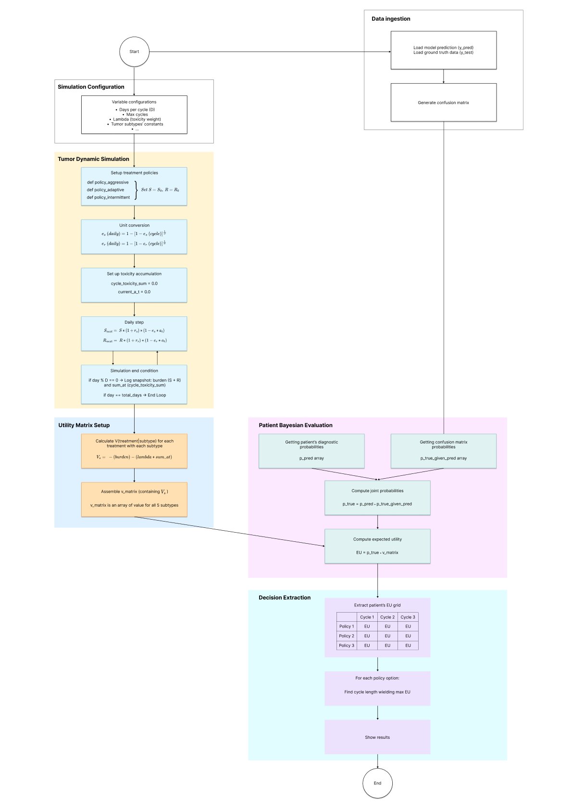
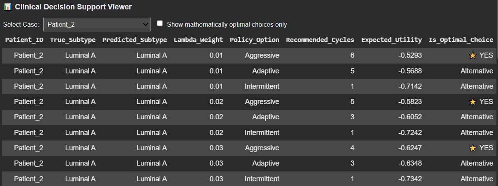

# TuanLe_Bayes-DSS-A-Clinical-Decision-Support-Module-for-Comparing-Treatment-Policies-
Bayes-DSS is a Clinical Decision Support module that uses Bayesian Decision Theory to compare breast cancer treatment policies. It integrates AI diagnostic priors and historical error rates with a 2-compartment tumor simulation to calculate Expected Utility, providing a mathematically robust, risk-averse safety net for clinical decision-making.

## I. Introduction
**Bayes-DSS** is a Clinical Decision Support System (CDSS) module that uses Bayesian Decision Theory to evaluate and compare cancer treatment policies. Instead of blindly trusting an AI classifier's top prediction, this module translates the AI's probabilistic uncertainty directly into human-understandable clinical consequences (tumor reduction vs. drug toxicity). 

**Flexibility & Constraints:**
This module is agnostic to the deep learning architecture; it can work with **any AI classification model** that produces predictive priors (softmax probabilities). In this repository, it natively ingests outputs from a custom multimodal Xception diagnostic model. 

However, please note that the biological parameters pre-configured in this model are **specifically designed for a 5-class breast cancer problem** representing the following subtypes:
1. Benign
2. Luminal A
3. Luminal B
4. HER2-enriched (HER2+)
5. Triple-Negative (TN)

If you wish to utilize this module for different cancer types or subtypes, you must manually update the biological constants (growth rates and drug efficacy) in the configuration dictionary to reflect the appropriate medical literature for those specific tumors.

---

## II. Model Architecture
The architecture of Bayes-DSS decouples the heavy image-processing deep learning pipeline from the decision analysis, ensuring rapid simulation and sensitivity testing. As illustrated in the system diagram, the workflow consists of 6 sequential blocks:

1. **Data Ingestion:** Loads the AI's raw diagnostic probabilities (`y_pred`) and the actual ground truth data (`y_test`) to generate the historical Confusion Matrix, which empirically quantifies the AI's error rate.
2. **Simulation Configuration:** An interactive dashboard to set critical variables without hardcoding. This includes Days per cycle ($D$), Max cycles, a range of toxicity penalty weights ($\lambda$), and the specific biological constants for each tumor subtype.
3. **Tumor Dynamic Simulation (The Physics Engine):** Sets up the treatment policies (Aggressive, Adaptive, Intermittent) and performs mathematical unit conversion (cycle to daily rates). It simulates daily biological tumor growth ($S_{next}, R_{next}$) and tracks toxicity accumulation. It strictly enforces a "clinical lock," meaning the virtual doctor evaluates the tumor and locks in the drug dose ($a_t$) only on Day 1 of a clinical cycle (e.g., every 21 days), perfectly mirroring real-world oncology practices.
4. **Utility Matrix Setup:** Calculates the deterministic clinical value $V$ for each treatment policy against each possible tumor subtype. The formula calculates the trade-off between the final tumor burden and the accumulated toxicity: $V = -(\text{burden}) - (\lambda \times \text{sum} \_ \text{at})$.
5. **Patient Bayesian Evaluation (The Decision Logic):** Retrieves the patient's individual diagnostic probabilities and updates them using the conditional probabilities from the Confusion Matrix. It then calculates the Expected Utility ($EU$) via the dot product of these joint probabilities and the Utility Matrix, mathematically hedging against AI misclassification.
6. **Decision Extraction:** Extracts the multi-dimensional $EU$ grid for each patient. It scans the grid to find the specific cycle length yielding the maximum Expected Utility for each policy option, ultimately flagging the mathematically absolute best strategies (including ties) to give doctors comparable alternatives.



---

## III. Mathematical Foundations: Tumor Dynamics and Decision Theory
The core logic of Bayes-DSS relies on two mathematical frameworks: a 2-compartment differential model for tumor biology, and Bayesian utility for risk mitigation.

### 1. Discrete 2-Compartment Tumor Model
Based on the Lotka-Volterra competition framework and adapted for discrete-time clinical steps, the tumor is divided into Sensitive ($S$) and Resistant ($R$) cells. Assuming the tumor is small enough relative to its carrying capacity ($K$) to omit the logistic saturation factor temporarily, the daily biological update equations are:

$$S_{t+1} = S_t \cdot (1 + r_s) \cdot (1 - e_s \cdot a_t)$$
$$R_{t+1} = R_t \cdot (1 + r_r) \cdot (1 - e_r \cdot a_t)$$

*   **$S_t, R_t$**: Volume of sensitive and resistant cells.
*   **$r_s, r_r$**: Intrinsic daily growth rates.
*   **$e_s, e_r$**: Daily drug efficacy (kill fraction). 
*   **$a_t \in [1]$**: The clinical dose intensity administered at time $t$.

### 2. Clinical Value Function
The physical outcome of a policy $\pi$ on a specific tumor subtype $s$ after $T$ total cycles is evaluated using a Value function $V$. It calculates the trade-off between the final tumor burden and the cumulative toxicity suffered by the patient:

$$V(\pi_i | s_j) = -(S_T + R_T) - \lambda \sum_{t=0}^{T} a_t$$

### 3. Bayesian Expected Utility ($EU$)
To act as a "safety net" against AI misclassification, the system does not calculate simple expected value. It updates the AI's prior probability $p(s)$ using the historical conditional probability $P(t | s)$ (the chance the tumor is truly $t$ given the AI predicted $s$, derived directly from the confusion matrix).

$$EU(\pi | s) = \sum_{t} P(t | s) V(\pi | t)$$

This guarantees that if the AI is uncertain, the model mathematically hedges its bets toward a safer, less toxic treatment policy.

---

## IV. Constants and Parameters
To ensure clinical credibility, the variables in this model are not arbitrary; they are mapped directly from published oncological and pharmacoeconomic literature.

*   **Biological Constants ($S_0, R_0, r_s, r_r, e_s, e_r$):** 
    *   Intrinsic growth rates ($r_s$) are derived from clinical Tumor Volume Doubling Time (TVDT) studies (e.g., Zhang et al., 2017). Resistant cells are modeled to grow at 50% the rate of sensitive cells due to fitness costs.
    *   Drug efficacy rates ($e_s, e_r$) are derived from pathologic complete response (pCR) tracking in neoadjuvant chemotherapy studies (e.g., Ubezio & Cameron, 2008). 

| Tumor Subtype | $S_0$ (Initial Sensitive) | $R_0$ (Initial Resistant) | $r_s$ (Daily Growth) | $r_r$ (Daily Growth) | $e_s$ (Efficacy / Cycle) | $e_r$ (Efficacy / Cycle) |
| :--- | :--- | :--- | :--- | :--- | :--- | :--- |
| **Benign** | 1.00 | 0.00 | 0.00076 | 0.00000 | 0.00 | 0.00 |
| **Luminal A** | 0.95 | 0.05 | 0.00270 | 0.00135 | 0.20 | 0.0325 |
| **Luminal B** | 0.90 | 0.10 | 0.00330 | 0.00165 | 0.35 | 0.0055 |
| **HER2+** | 0.825 | 0.175 | 0.00380 | 0.00304 | 0.60 | 0.125 |
| **Triple-Negative** | 0.60 | 0.40 | 0.00550 | 0.00440 | 0.55 | 0.085 |

*(Note: The simulation engine automatically converts the per-cycle drug efficacy constants into daily kill fractions based on the user's selected cycle length D)*

*   **Treatment Cycle Length ($D$):** Set to 21 days by default, mapping to standard neoadjuvant regimens evaluated in clinical practice (Keam et al., 2017).
*   **Toxicity Penalty Weight ($\lambda$):** Represents the "Disutility of Treatment". Instead of using a single fixed number, the model sweeps across a range of $\lambda$ values (e.g., 0.01 to 1.0) to perform **Decision Curve Analysis (DCA)**. A low $\lambda$ mimics mild side effects or a highly resilient patient, while a high $\lambda$ mimics severe toxicity.

---

## V. Result & Interpretations
The output of the module is an extensive multi-dimensional grid exported as a CSV file (e.g., `optimal_treatments_full_grid.csv`). 



### How to Read the Output Data
The CSV contains the following columns: `Patient_ID`, `True_Subtype`, `Predicted_Subtype`, `Lambda_Weight`, `Policy_Option`, `Recommended_Cycles`, `Expected_Utility`, `Is_Optimal_Choice`.

*   **Sensitivity Analysis via Lambda:** As you look down the rows for a single patient, you will see the `Lambda_Weight` increase. At low lambda (e.g., 0.01), the model acts aggressively, prioritizing tumor reduction and recommending extended cycles. As lambda crosses critical thresholds, the mathematical penalty of toxicity outweighs the oncological benefit, and the model correctly recommends halting treatment early (1 cycle).
*   **Understanding Ties (⭐ YES vs Alternative):** The model explicitly flags all mathematically optimal choices. If both "Aggressive" and "Adaptive" policies are flagged as `⭐ YES` for 1 cycle, it means the tumor biology has not yet crossed the threshold required for the Adaptive policy to reduce the dose. Their biological outcomes and toxicity penalties are identical up to that point.
*   **Diagnostic Mismatches:** By filtering for patients where `True_Subtype != Predicted_Subtype`, you can observe the Bayesian Safety Net in action. You will see how the Expected Utility defaults to safer, compromised regimens when the AI makes a highly uncertain prediction.

## VI. Interactive Sensitivity Analysis Dashboard

In clinical reality, biological constants vary between patients, and deep learning predictions carry inherent uncertainty. To ensure the clinical safety and robustness of the recommended treatments, this repository includes an interactive **Sensitivity Analysis Dashboard**. 

This tool allows you to isolate a specific biological variable and apply a mathematical "shock" (a controlled range of variance) to it, observing how those changes impact the final Expected Utility (EU) and treatment recommendations.

### How to Use It


Run the Sensitivity Analysis cell in the Jupyter Notebook to generate the interactive UI. You will configure two main sections:

**1. Shock Configuration (What are we testing?)**
*   **Target Subtype & Treatment:** Select the specific tumor subtype (e.g., Triple-Negative) and the treatment policy you want to evaluate. You can select a specific policy or track the *All Optimal (Global Best)* option.
*   **Variable to Shock:** Choose the exact biological constant you want to test. You can shock the Initial Tumor Size ($S_0, R_0$), Intrinsic Growth Rates ($r_s, r_r$), or Drug Efficacies ($e_s, e_r$).
*   **Shock Range:** Define the `Min Shock`, `Max Shock`, and `Increment Step`. For example, you can test how the model behaves if the drug efficacy ($e_s$) fluctuates from -0.3 (30% less effective) to +0.3 (30% more effective) in steps of 0.05.

**2. Static Parameters (What stays constant?)** 
*   Lock in the environmental variables for the simulation. You must set a fixed Toxicity Penalty Weight ($\lambda$), Cycle Duration ($D$), Maximum Cycles ($n$), and your specific Adaptive/Intermittent policy thresholds.

Once configured, click **"Run Sensitivity Analysis"**. The engine will recalculate the entire Bayesian Utility matrix iteratively across your defined shock range.

### How to Interpret the Results

The resulting output reveals the mathematical stability of your treatment decision. When reviewing the results, look for these two primary clinical indicators:

*   **Identifying Clinical "Tipping Points":** As the shocked variable increases or decreases, you will observe the exact threshold where the model changes its mind. For example, if you incrementally increase the resistant growth rate ($r_r$), you will see the precise mathematical point where the model shifts from recommending 6 cycles down to 1 cycle to avoid useless toxicity. 
*   **Assessing Decision Robustness:** If the optimal policy and recommended cycle count remain the same despite massive shocks to the biological constants, the treatment decision is highly **robust**. If the recommendations swing wildly following a tiny fractional change (e.g., a 0.05 shift in $e_s$), the clinical decision is highly **sensitive** to that variable, alerting the physician that they should proceed with caution and close monitoring.

---

## VII. Installation and Usage Guide

### Prerequisites
```bash
pip install numpy pandas scikit-learn ipywidgets\
```
This module is built to run interactively in a Jupyter or Google Colab notebook. It requires two primary data inputs, typically loaded from an `.npz` file generated during your AI's testing phase:

*   **`y_pred`**: An array containing the AI's predicted softmax probabilities (priors) for each patient, formatted as `(number_of_patients, number_of_classes)`.
*   **`y_test`**: An array of the actual ground-truth labels. The system uses this exclusively to generate a **confusion matrix**, which serves as a historical track record of your AI's accuracy.

> **Note:** This specific repository is pre-configured to ingest prediction arrays from a custom multimodal Xception network. However, if you wish to apply this Decision Support System (DSS) to your own classifier, you simply need to swap out the `y_pred` and `y_test` variables in the Data Ingestion block with your own NumPy arrays.

### Usage

1. **Run the script** inside your Jupyter Notebook environment.
2. **Adjust the clinical parameters** using the generated visual dashboard to set your boundaries (e.g., Days per cycle, Maximum cycles, and the Lambda toxicity penalty steps).
3. **Click the "Run Simulation & Extract All" button**.
4. **Review your results:** The engine will automatically simulate the continuous biological tumor physics, apply Bayesian probability transformations, and export a CSV dataframe. This file will clearly display the comparative **Expected Utility** of every treatment policy for every individual patient.

--------------------------------------------------------------------------------
## VIII. References
The mathematical modeling and parameter calibrations used in this framework are supported by the following literature:

Ubezio, P., & Cameron, D. (2008). Cell killing and resistance in pre-operative breast cancer chemotherapy. BMC Cancer, 8(1), 201. https://doi.org/10.1186/1471-2407-8-201

Zhang, S., Ding, Y., Zhou, Q., Wang, C., Wu, P., & Dong, J. (2017). Correlation Factors Analysis of Breast Cancer Tumor Volume Doubling Time Measured by 3D-Ultrasound. Medical science monitor : international medical journal of experimental and clinical research, 23, 3147–3153. https://doi.org/10.12659/msm.901566

Gatenby, R. A., Silva, A. S., Gillies, R. J., & Frieden, B. R. (2009). Adaptive therapy. Cancer research, 69(11), 4894–4903. https://doi.org/10.1158/0008-5472.CAN-08-3658

Keam, B., Im, S. A., Lee, K. H., Han, S. W., Oh, D. Y., Kim, J. H., Lee, S. H., Han, W., Kim, D. W., Kim, T. Y., Park, I. A., Noh, D. Y., Heo, D. S., & Bang, Y. J. (2011). Ki-67 can be used for further classification of triple negative breast cancer into two subtypes with different response and prognosis. Breast cancer research : BCR, 13(2), R22. https://doi.org/10.1186/bcr2834
